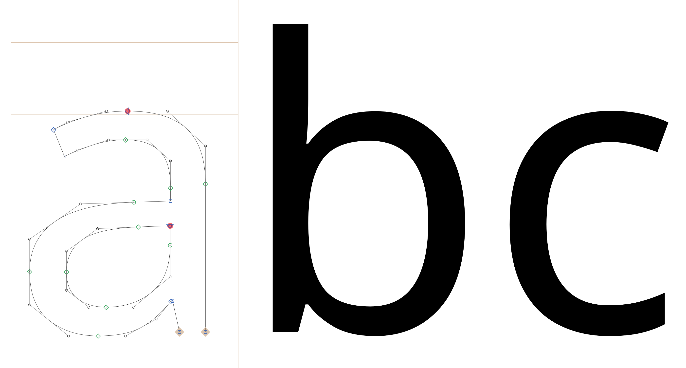

# Notes on mastering for Noto Sans Nushu, by Stephen Nixon / Arrow Type

(This was from a slightly earlier round of mastering; I'm stowing the notes here in case they are useful later)

## Building a basic font with FontMake

My ultimate goal is to create a simple webpage that lays out Noto Sans Nushu in a grid of unicodes. However, to do so, I need to build a working font file. So, I am starting by building with FontMake.


My first attempt was to create a virtual environment and install fontmake, then run:

```
fontmake -o ttf -g source/NotoSansNushu_200326.glyphs --output-dir fonts
```

However, this stopped with the following error:

```
(venv) $ fontmake -o otf -g source/NotoSansNushu_200326.glyphs
INFO:fontmake.font_project:Building master UFOs and designspace from Glyphs source
INFO:glyphsLib.classes:Parsing "source/NotoSansNushu_200326.glyphs" file into <GSFont>
WARNING:glyphsLib.builder.builders.UFOBuilder:Noto Sans Nushu 02 Regular: Glyph CR, layer Regular: Duplicate glyph layer name
WARNING:glyphsLib.builder.builders.UFOBuilder:Noto Sans Nushu 02 Regular: Glyph CR, layer Regular: Duplicate glyph layer name

# etc etc etc

WARNING:glyphsLib.builder.builders.UFOBuilder:Noto Sans Nushu 02 Regular: Glyph .notdef, layer Bold Condensed: Duplicate glyph layer name
INFO:fontmake.font_project:Building OTF for NotoSansNushu02-Regular
INFO:ufo2ft:Pre-processing glyphs
INFO:ufo2ft.filters:Running DecomposeComponentsFilter on NotoSansNushu02-Regular
INFO:ufo2ft.filters:Running RemoveOverlapsFilter on NotoSansNushu02-Regular
ERROR:ufo2ft.filters.removeOverlaps:Failed to remove overlaps for A
fontmake: Error: In 'source/NotoSansNushu_200326.glyphs' -> 'master_ufo/NotoSansNushu02-Regular.designspace' -> 'master_ufo/NotoSansNushu02-Regular.ufo': Compiling UFO failed: ('Trying to perform operation on unsupported segment type.', 'qcurve')
```

So, it seems that there must be a quadratic (TTF) curve, somewhere in the file. I have to figure out where that is.

Opening the Glyphs file, I see the problem:



The Latin alphabet of Noto Sans was copied in from a TTF file. I need to find a cubic version of the source, to copy that in, *OR* potentially just delete those characters entirely. I'll opt for the lighter-touch solution for now, though, as those glyphs probably help make the design workflow simpler.

I downloaded NotoSans-MM.glyphs from here; https://github.com/googlefonts/noto-source/blob/39f54503fdc61a146702497d349bf3ce9eb83695/src/NotoSans-MM.glyphs

Then had to export the Regular master as a UFO to copy-paste into the Nushu file (for some reason, direct copy-paste between GlyphsApp files was copying the Light master instead of the Regular master).

It builds!

## Building a test webpage

I'm adapting a [script originally made for the Recursive project](https://github.com/arrowtype/recursive/blob/23bf5fdbf5938a5ac533c7d8bd969226d939e882/src/build-scripts/data-tables-for-website/build-html-unicode-grid-from-string.py) that builds a Unicode data table for the Recursive minisite, but cleaning it up and simplifying it for this project.

If desired, this can be hosted on GitHub Pages.
